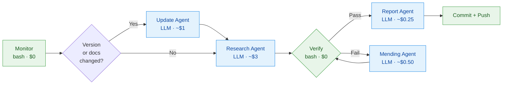

# claude-code-documentation-knowledge — auto-updated

An auto-updated Claude Code skill that tracks the official Claude
Code documentation (`code.claude.com/docs/*`) and bug-labeled GitHub
issues at `anthropics/claude-code`, then surfaces a curated reference
Claude can read at intent-match time. It is not a full mirror — only
changes that affect the reference surface (schema fields, event
names, flags, env vars) flow in.

<!-- The two stamps below are auto-filled by the daily pipeline. -->
**Claude Code version**: v<version>
**Last updated**: <YYYY-MM-DD>
**Pipeline status**: see [`reports/`](reports/) for daily runs.

## What it does

- Tracks the npm version of `@anthropic-ai/claude-code` and every
  GitHub release at `anthropics/claude-code`.
- Diffs `code.claude.com/llms.txt` (the docs index) daily; when a
  page changes, the research agent fetches it and updates the
  corresponding section of `SKILL.md`.
- Scans bug-labeled issues at `anthropics/claude-code`. Substantive
  user-impacting bugs become `## Known Issues` entries in SKILL.md;
  common user mistakes with auto-correctable patterns become rules
  in `rules/claude-code.md`.
- Runs a deterministic `verify.sh` after every update; failures
  trigger a self-mending agent with up to 2 retries.

## Installation

```bash
git clone https://github.com/xiaolai/claude-code-documentation-knowledge-autoupdated \
  ~/.claude/skills/claude-code-documentation-knowledge-autoupdated
```

Claude Code auto-discovers skills under `~/.claude/skills/`, so no
further configuration is required — the skill becomes available on the
next Claude Code session.

To pull the latest updates:

```bash
cd ~/.claude/skills/claude-code-documentation-knowledge-autoupdated && git pull
```

Optional: auto-update daily (the pipeline commits at 08:00 UTC, so
sync any time after). The redirect captures pull failures to a log
instead of swallowing them silently:

```bash
(crontab -l 2>/dev/null; \
 echo "30 9 * * * cd ~/.claude/skills/claude-code-documentation-knowledge-autoupdated && git pull -q >> ~/.claude/skill-pull.log 2>&1") | crontab -
```

## Architecture

The skill uses a **router + per-surface deep references** layout so the
LLM-facing content stays under 100 lines (intent-match latency) while
the deep content can grow without bloating every conversation.

```
SKILL.md                          Router — intent-match + dispatch table
SKILL-settings.md                 Deep ref: settings.json keys, scope, examples
SKILL-hooks.md                    Deep ref: hook events, input/output shapes
SKILL-slash-commands.md           Deep ref: slash command frontmatter + syntax
SKILL-mcp.md                      Deep ref: .mcp.json + transports
SKILL-plugins.md                  Deep ref: plugin manifest + marketplaces
SKILL-cli.md                      Deep ref: env vars, CLI flags, perms, layout
SKILL-known-issues.md             Bug catalog with workarounds

rules/                            Path-scoped auto-correction rules
  settings.md                       fires on .claude/settings*.json
  mcp.md                            fires on .mcp.json
  plugins.md                        fires on plugin/marketplace manifests
  hooks.md                          fires on .claude/hooks/**
  skills-agents-commands.md         fires on skills / agents / commands

templates/                        Executable example configs (typechecked)
schema/                           JSONSchemas — what every fenced example
                                  in SKILL-*.md must validate against
scripts/                          Verification toolchain
  validate-examples.sh              Schema-validate fenced JSON blocks
  typecheck-templates.sh            Parse-check every templates/ file
  check-populated.sh                Liveness gate (post-scaffold)
  check-diff-size.sh                Pre-commit safety gate

README.md                         This file (auto-updated header + activity)
CHANGELOG.md                      Human-curated history
.claude-plugin/plugin.json        Plugin manifest

agent/                            Pipeline (maintainer-only — ignore as a consumer)
  monitor.sh                        Change detection — npm + GitHub + llms.txt
  update-agent.ts                   Version-bump rewrites
  research-agent.ts                 Docs audit + issue research
  mending-agent.ts                  Self-heal on verify failure
  report-agent.ts                   Daily report + README activity table
  verify.sh                         Deterministic post-agent checks
  state.json                        Tracked versions, issues, pages, scaffold flag

.github/workflows/cc-update-check.yml   Daily cron pipeline
.github/PULL_REQUEST_TEMPLATE/auto-update.md   Draft-PR review checklist
reports/                          Daily run digests
```

### Safety gates

After each daily run, four gates run before commit:

| Gate | Catches |
|---|---|
| `typecheck-templates.sh` | Broken templates (invalid JSON, shell syntax error, missing frontmatter) |
| `validate-examples.sh` | Fenced JSON examples in SKILL-*.md that don't match the schema mapped to that file |
| `check-populated.sh` | Stub markers (`*Populated by the research agent*`) lingering after scaffold mode ends |
| `check-diff-size.sh` | Any single tracked file rewritten by >20% in one run (catches runaway-LLM failures) |

If any gate fails, the run is committed to `auto/<YYYY-MM-DD>-pending-review` and a draft PR is opened. The main branch never receives unreviewed content from a flagged run.

## Pipeline

Runs via GitHub Actions at 08:00 UTC daily, or manually via
`workflow_dispatch`.



## Cost (maintainer-side only)

The pipeline runs on the maintainer's Anthropic subscription
(`CLAUDE_CODE_OAUTH_TOKEN`). Users pay nothing — just `git clone`
and `git pull`.

## Recent activity

*Populated by the report agent after the first pipeline run (daily 08:00 UTC). Until then, this table is empty by design.*

| Date | Result | Notes |
|------|--------|-------|
| — | — | — |

## Links

- [Claude Code docs](https://code.claude.com/docs/en/overview.md)
- [anthropics/claude-code on GitHub](https://github.com/anthropics/claude-code)
- [npm package](https://www.npmjs.com/package/@anthropic-ai/claude-code)
- [Bug tracker](https://github.com/anthropics/claude-code/issues?q=is%3Aissue+is%3Aopen+label%3Abug)

---

**Repository**: https://github.com/xiaolai/claude-code-documentation-knowledge-autoupdated
**License**: MIT
