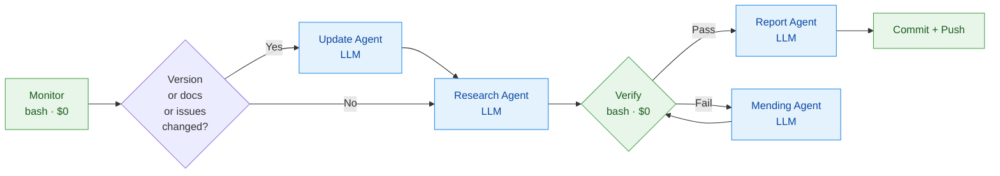

# claude-code-documentation-knowledge-autoupdated — scaffold design

**Status:** Scaffolded 2026-05-17, pre-push. First pipeline run not yet executed.

This is the local design memo for the skill repo. It is gitignored
(`dev-docs/` is excluded). The broader cross-skill plan that covers
this skill plus the planned Anthropic-API and MCP-spec siblings lives
in `~/github/xiaolai/myprojects/claudepot-app/dev-docs/anthropic-doc-skills-plan.md`.

## Why this skill exists

Claude Code is the substrate every Claudepot user works on. Its
settings schema, hook events, slash-command syntax, MCP config, and
plugin manifest change weekly (npm ships ~daily; docs at
`code.claude.com` track the surface). A statically-curated reference
skill drifts in days. This skill solves that with a daily pipeline
that re-reads the upstream docs + scans `anthropics/claude-code`
GitHub issues, then rewrites `SKILL.md` / `rules/claude-code.md` to
match.

## Provenance

Forked from `claude-agent-sdk-skill-autoupdated`. The pipeline shape
(monitor → update → research → verify → mend → report) was proven on
that skill and is duplicated here rather than extracted into a shared
package. Three reasons:

1. Three small standalone repos are easier to evolve than four repos
   coupled by an internal npm dep.
2. Each skill's source-side fetch code (npm, GitHub, docs) is
   substantively different. The "shared" surface is the framework
   shape, not the code.
3. The daily-cron LLM agents read the local files; cross-repo imports
   would just add latency.

## Sources (verified)

| Source | URL | What we read | Probe result |
|---|---|---|---|
| npm | `npm view @anthropic-ai/claude-code` | Current version (`v2.1.143` at scaffold time), engines | Works |
| GitHub releases | `gh api repos/anthropics/claude-code/releases/latest` | Tag, name, body, publishedAt | Works |
| GitHub issues | `gh api repos/anthropics/claude-code/issues?labels=bug&state=open&sort=created` | New bug-labeled issues + tracked-issue state | Works |
| Docs index | `https://code.claude.com/llms.txt` | 132-page URL list with descriptions, 28 KB | Works |
| Per-page docs | `https://code.claude.com/docs/en/<slug>.md` | Page Markdown for sections that changed | Works |

### Source discovery — what was wrong on first attempt

- **First assumption:** CC docs were at
  `platform.claude.com/docs/en/claude-code/*.md`. Probe returned 0
  matches in `llms.txt`.
- **Reality:** CC has its own doc site at `code.claude.com`,
  separate from `platform.claude.com` (which is API/SDK docs only).
  `docs.claude.com/en/docs/claude-code/*` 301s to
  `code.claude.com/docs/en/*`.
- **Lesson encoded:** `agent/monitor.sh` calls
  `code.claude.com/llms.txt` explicitly. Don't "fix" this to
  `platform.claude.com`.

### MCP spec repo (for future sibling skill, not this one)

While verifying URLs I also discovered the MCP spec repo is at
`modelcontextprotocol/modelcontextprotocol`, not
`modelcontextprotocol/specification` (which 404s). Recorded here
because it bit me once already.

## Pipeline shape

- **Monitor**: deterministic bash. Detects (a) npm version bump,
  (b) GH release, (c) docs-index hash change with per-URL diff,
  (d) tracked-issue state changes, (e) new bug-labeled issues
  above `lastScannedIssueNumber`. Always seeds fresh state even when
  no change — so first run primes `state.json` cleanly.
- **Update agent**: only fires on version change. Rewrites version
  strings across SKILL.md / README.md / plugin.json / rules.
- **Research agent**: fires every day. Three parts — docs surface
  audit (Part A), GitHub issues research (Part B), final consistency
  checks (Part C). Allowed tools: Read, Write, Edit, MultiEdit,
  Bash, Grep, Glob, WebFetch.
- **Verify**: deterministic bash. Version-string presence/absence,
  JSON validity, required-file presence.
- **Mending**: only on verify failure. Up to 2 retries.
- **Report**: writes `reports/<YYYY-MM-DD>.md`, updates README's
  "Last updated" stamp and 7-day activity table.

## File-structure rationale

| Path | Why it's there |
|---|---|
| `SKILL.md` | The single LLM-facing reference. Sections are pre-named so descriptions are stable for intent-matching; bodies are stubs to be filled by the research agent on first run. |
| `rules/claude-code.md` | Path-scoped auto-correction rules. Fires when the user edits `.claude/settings*.json`, `.mcp.json`, plugin manifests, hooks, skills, agents, commands. Starts empty; populates as research agent finds real user mistakes. |
| `README.md` | Human-facing repo description. Self-updating header (`Last updated`) and activity table (last 7 days). |
| `.claude-plugin/plugin.json` | Plugin manifest. Description carries the "Last updated" stamp so search engines / installers see freshness. |
| `agent/*` | The pipeline. Never edited by the agents themselves; the prompts explicitly forbid touching this directory. |
| `.github/workflows/cc-update-check.yml` | Daily cron at 08:00 UTC. Repo-gated by `if: github.repository == 'xiaolai/claude-code-documentation-knowledge-autoupdated'` to prevent forks accidentally running the pipeline. |

## Stub strategy

`SKILL.md` and `rules/claude-code.md` ship as section skeletons, not
finished prose. Three reasons:

1. **Truth maintenance.** Writing the content statically means it's
   wrong the day after the next docs update. Letting the research
   agent populate from live docs on first run means it's accurate
   from day one.
2. **Verifiability.** A finished SKILL.md authored by me has no
   audit trail. One authored by the research agent has a state.json
   entry for every section / known-issue saying which page / issue
   it came from.
3. **Cost.** SKILL.md content drafting is roughly the same LLM cost
   whether I do it interactively or the research agent does it as
   step 1 of its daily run. Better to spend it where it leaves an
   audit trail.

The risk: the first commit lands with a barely-useful SKILL.md.
That's acceptable because the pipeline replaces it within minutes of
the first manual workflow trigger.

## Cost model

- **Dollar cost: $0.** Pipeline uses `CLAUDE_CODE_OAUTH_TOKEN`
  (Max 20x subscription), not `ANTHROPIC_API_KEY`.
- **Rate-limit cost: ~30 min/day** of subscription LLM time for
  this skill (research is the heavy step). Combined with the two
  planned sibling skills that's ~90 min/day across the daily window.
- **GH Actions cost: ~5 min/day** on the free tier (private repo
  free tier is 2000 min/month — we use <300 min/month).

Use the *least-active* Max 20x account from `CLAUDE.local.md` for
the OAuth token so your own daily Claude Code work doesn't compete
with the pipeline.

## Open follow-ups

- **First-run verification.** The first manual `workflow_dispatch`
  trigger will reveal whether `monitor.sh` works end-to-end with
  fresh state. Likely needs one small fix-up iteration.
- **Description tuning.** The skill's `description` field controls
  intent-matching against the bundled `claude-api` skill (which is
  shipped with Claude Code and cannot be removed). If the bundled
  skill wins matches we want, narrow this skill's description further.
- **WebFetch tool availability.** The research agent prompt assumes
  `WebFetch` is available to the agent's `query()` call. Confirmed
  in `allowedTools`. If the Anthropic Agent SDK starts gating
  WebFetch behind a permission flag, the prompt will need updating.

## Ship checklist (not yet executed)

1. Create empty private repo:
   `gh repo create xiaolai/claude-code-documentation-knowledge-autoupdated --private`
2. `cd` here, `git init && git add -A && git commit -m "initial scaffold"`
3. `git remote add origin git@github.com:xiaolai/claude-code-documentation-knowledge-autoupdated.git`
4. `git branch -M main && git push -u origin main`
5. Add `CLAUDE_CODE_OAUTH_TOKEN` repo secret (Settings → Secrets and
   variables → Actions). Use the least-active Max 20x account.
6. Trigger first run: `gh workflow run cc-update-check.yml`
7. Watch logs: `gh run watch`
8. Pull the first auto-commit locally to confirm SKILL.md /
   rules/claude-code.md got populated.
