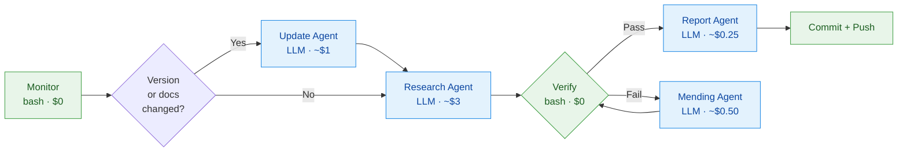

# claude-code

> **Looking for structured learning?** Anthropic publishes free courses on
> [Skilljar](https://anthropic.skilljar.com/) — try "Claude Code in
> Action" and "Building Effective Agents." This skill is the
> always-current reference Claude reads at intent-match time; the
> courses teach you the underlying concepts.

An auto-updated Claude Code skill that tracks the official Claude
Code documentation (`code.claude.com/docs/*`) and bug-labeled GitHub
issues at `anthropics/claude-code`, then surfaces a curated reference
Claude can read at intent-match time. It is not a full mirror — only
changes that affect the reference surface (schema fields, event
names, flags, env vars) flow in.

<!-- The two stamps below are auto-filled by the pipeline. -->
**Claude Code version**: v2.1.160
**Last updated**: 2026-06-21
**Pipeline status**: see [`reports/`](reports/) for per-run records.

## What it does

- Tracks the npm version of `@anthropic-ai/claude-code` and every
  GitHub release at `anthropics/claude-code`.
- Diffs `code.claude.com/llms.txt` (the docs index) daily; when a page
  changes, the research agent fetches it and updates the matching
  surface file (`SKILL-settings.md`, `SKILL-hooks.md`, `SKILL-mcp.md`,
  etc.). The router `SKILL.md` dispatches Claude to the right surface
  at intent-match time, keeping per-conversation context small.
- Scans bug-labeled issues at `anthropics/claude-code`. Substantive
  user-impacting bugs become `KI <N>` entries in
  `SKILL-known-issues.md`; common user mistakes with auto-correctable
  patterns become rules in the matching `rules/*.md` file (one per
  surface: settings / mcp / plugins / hooks / skills-agents-commands).
- Runs deterministic safety gates after every research pass
  (`validate-examples`, `typecheck-templates`, `check-populated`,
  `check-docs-drift`, `check-diff-size` — see `scripts/`); any gate
  failure routes the run to a draft PR on `auto/<date>-pending-review`
  instead of pushing to `main`.
- Self-heals on `verify.sh` failure via a mending agent with up to
  2 retries.

## Installation

```bash
git clone https://github.com/xiaolai/anthropic-docs \
  ~/.claude/skills/anthropic-docs
```

Claude Code auto-discovers skills under `~/.claude/skills/`, so no
further configuration is required — the skill becomes available on the
next Claude Code session.

To pull the latest updates:

```bash
cd ~/.claude/skills/anthropic-docs && git pull
```

Optional: auto-update daily (the pipeline commits at 08:00 UTC, so
sync any time after). The redirect captures pull failures to a log
instead of swallowing them silently:

```bash
# `|| true` on the inner `crontab -l` ensures a fresh user with no
# existing crontab doesn't fail this pipeline (idiomatic "preserve
# existing entries OR start fresh").
(crontab -l 2>/dev/null || true; \
 echo "30 9 * * * cd ~/.claude/skills/anthropic-docs && git pull -q >> ~/.claude/skill-pull.log 2>&1") | crontab -
```

## Architecture

The skill uses a **router + per-surface deep references** layout so the
LLM-facing content stays under 100 lines (intent-match latency) while
the deep content can grow without bloating every conversation.

```
SKILL.md                          Router — intent-match + dispatch table
SKILL-settings.md                 Deep ref: settings.json keys, scope, examples
SKILL-hooks.md                    Deep ref: hook events, input/output shapes
SKILL-slash-commands.md           Deep ref: slash command frontmatter + syntax
SKILL-mcp.md                      Deep ref: .mcp.json + transports
SKILL-plugins.md                  Deep ref: plugin manifest + marketplaces
SKILL-cli.md                      Deep ref: env vars, CLI flags, perms, layout
SKILL-known-issues.md             Bug catalog with workarounds

rules/                            Path-scoped auto-correction rules
  settings.md                       fires on .claude/settings*.json
  mcp.md                            fires on .mcp.json
  plugins.md                        fires on plugin/marketplace manifests
  hooks.md                          fires on .claude/hooks/**
  skills-agents-commands.md         fires on skills / agents / commands

templates/                        Executable example configs (typechecked)
schema/                           JSONSchemas — what every fenced example
                                  in SKILL-*.md must validate against
scripts/                          Verification toolchain
  validate-examples.sh              Schema-validate fenced JSON blocks
  typecheck-templates.sh            Parse-check every templates/ file
  check-populated.sh                Liveness gate (post-scaffold)
  check-diff-size.sh                Pre-commit safety gate

README.md                         This file (auto-updated header + activity)
CHANGELOG.md                      Human-curated history
.claude-plugin/plugin.json        Plugin manifest

agent/                            Pipeline (maintainer-only — ignore as a consumer)
  monitor.sh                        Change detection — npm + GitHub + llms.txt
  update-agent.ts                   Version-bump rewrites
  research-agent.ts                 Docs audit + issue research
  mending-agent.ts                  Self-heal on verify failure
  report-agent.ts                   Daily report + README activity table
  verify.sh                         Deterministic post-agent checks
  state.json                        Tracked versions, issues, pages, scaffold flag

.github/workflows/cc-update-check.yml   Daily cron pipeline
.github/PULL_REQUEST_TEMPLATE/auto-update.md   Draft-PR review checklist
reports/                          Daily run digests
```

### Safety gates

After each pipeline run, five gates run before commit:

| Gate | Catches |
|---|---|
| `typecheck-templates.sh` | Broken templates (invalid JSON, shell syntax error, missing frontmatter) |
| `validate-examples.sh` | Fenced JSON examples in SKILL-*.md that don't match the schema mapped to that file. PASS 2 (informational) also cross-checks each schema's top-level property keys against the upstream docs snapshot. |
| `check-populated.sh` | Stub markers (`*Populated by the research agent*`) lingering after scaffold mode ends |
| `check-docs-drift.sh` | Upstream `code.claude.com/llms.txt` index hash has changed since the committed `docs-snapshot/` was refreshed. Fast mode (index-only) runs daily; `--deep` mode (per-page content hash) is manual / weekly. |
| `check-diff-size.sh` | Any single tracked file rewritten by >20% in one run (catches runaway-LLM failures) |

If any gate fails, the run is committed to `auto/<YYYY-MM-DD>-pending-review` and a draft PR is opened. The main branch never receives unreviewed content from a flagged run.

## Pipeline

Runs via GitHub Actions at 08:00 UTC daily, or manually via
`workflow_dispatch`.



## Cost (maintainer-side only)

The pipeline runs on the maintainer's Anthropic subscription
(`CLAUDE_CODE_OAUTH_TOKEN`). Users pay nothing — just `git clone`
and `git pull`.

## Recent activity

| Date | Update | Research | Mending | Report | Total | Notes |
|------|--------|----------|---------|--------|-------|-------|
| 2026-06-02 | success | CC v2.1.159 → v2.1.160; docs +1/-0 |
| 2026-06-01 | success | CC v2.1.158 → v2.1.160 |
| 2026-05-31 | success | docs +2/-0 |
| 2026-05-30 | success | CC v2.1.156 → v2.1.160; docs +0/-30 |
| 2026-05-29 | success | CC v2.1.153 → v2.1.160; docs +1/-30 |
| 2026-05-28 | partial | CC v2.1.152 → v2.1.160; docs +0/-30 |
| 2026-05-27 | partial | CC v2.1.150 → v2.1.160; docs +2/-31 |

## For maintainers

### `nlpm` plugin for quality + security tooling

This repo's `.claude/settings.json` enables `nlpm@xiaolai` so the
maintenance commands (`/nlpm:score`, `/nlpm:trend`, `/nlpm:security-scan`,
`/nlpm:check`) work out of the box when you clone the repo for
development. The plugin lives in the `xiaolai/claude-plugin-marketplace`
marketplace. To install:

```bash
claude plugin marketplace add xiaolai/claude-plugin-marketplace
claude plugin install nlpm@xiaolai --scope project
```

(End users who only consume the skill via `~/.claude/skills/` don't need
the plugin — the maintenance commands are for editing the skill, not
using it.)

### Refreshing the upstream docs snapshot

`docs-snapshot/code.claude.com/` is a committed, version-pinned mirror of
the official Claude Code docs that lives in this repo. Schemas under
`schema/` and the seeded examples in `SKILL-*.md` are validated against
this snapshot via `scripts/validate-examples.sh` (Pass 2). The pipeline
gate `scripts/check-docs-drift.sh` fires when upstream `llms.txt` changes
and a maintainer must refresh:

```bash
# Run a manual refresh. Re-fetches all 132 pages from code.claude.com,
# sanitises via the same defang pipeline that monitor.sh uses, and
# rewrites docs-snapshot/MANIFEST.json with new sha256s + timestamp.
bash scripts/refresh-docs-snapshot.sh

# Review what changed before committing.
git diff docs-snapshot/

# Verify gates still pass.
bash scripts/validate-examples.sh
bash scripts/check-docs-drift.sh

# Commit with a CHANGELOG entry naming the new snapshot pin
# (date + new index sha256 prefix).
```

The snapshot is intentionally manual (not auto-refreshed by CI). Auto-
refreshing would defeat the version-pinned baseline — a human should see
the diff before our local truth shifts under us.

## Links

- [Claude Code docs](https://code.claude.com/docs/en/overview.md)
- [anthropics/claude-code on GitHub](https://github.com/anthropics/claude-code)
- [npm package](https://www.npmjs.com/package/@anthropic-ai/claude-code)
- [Bug tracker](https://github.com/anthropics/claude-code/issues?q=is%3Aissue+is%3Aopen+label%3Abug)

---

**Repository**: https://github.com/xiaolai/anthropic-docs
**License**: MIT
